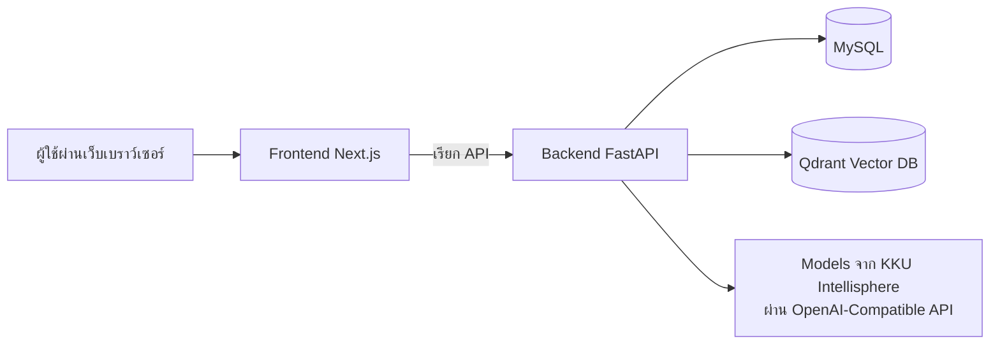
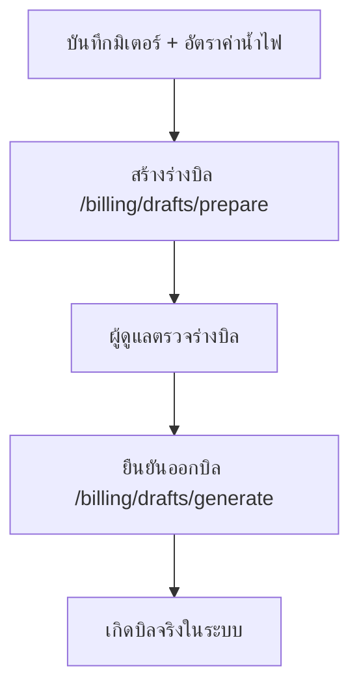

# RoomKub: ระบบจัดการหอพัก (ฉบับภาษาไทยสำหรับใช้งานและพรีเซ็นต์)

เอกสารนี้เขียนให้คน 2 กลุ่มใช้งานได้ทันที:
- คนในทีมที่เพิ่งเข้ามาใหม่: อ่านแล้วเข้าใจระบบได้เร็ว
- คนที่ต้องนำไปพรีเซ็นต์: ใช้เนื้อหานี้ทำสไลด์ต่อได้เลย

---

## 1) ภาพรวมโครงการ

**RoomKub** คือระบบบริหารหอพักแบบครบวงจร ครอบคลุมงานหลัก:
- จัดการห้องพัก
- จัดการผู้เช่า
- บันทึกมิเตอร์น้ำ/ไฟ
- จัดการอัตราค่าน้ำค่าไฟ
- เตรียมร่างบิลและออกบิลจริง
- ติดตามการชำระเงินและสลิป
- ส่งแจ้งเตือน (รวม LINE Group)
- รายงานเชิงบริหารจาก SQL VIEW (10 รายงาน)
- ผู้ช่วยตอบคำถาม (Chatbot RAG)

---

## 2) Project Structure

```text
frontend-roomkub/
├─ frontend/                         # ฝั่งหน้าจอผู้ใช้ (Next.js)
│  ├─ app/                           # route ทั้งหมดของระบบ
│  │  ├─ (auth)/                     # หน้าเข้าสู่ระบบ
│  │  └─ (dashboard)/                # หน้าทำงานหลัก
│  │     ├─ dashboard/               # ภาพรวมระบบ
│  │     ├─ rooms/                   # จัดการห้อง
│  │     ├─ tenants/                 # จัดการผู้เช่า
│  │     ├─ meters/                  # มิเตอร์
│  │     ├─ utility-rates/           # อัตราค่าน้ำ/ไฟ
│  │     ├─ billing/                 # รอบบิล/ร่างบิล/ออกบิล
│  │     ├─ payments/                # ชำระเงิน (ฝั่งแอดมิน)
│  │     ├─ payment-tenant/          # ชำระเงิน (ฝั่งผู้เช่า)
│  │     ├─ notifications/           # แจ้งเตือน
│  │     ├─ reports/                 # รายงาน VIEW
│  │     ├─ knowledge-base/          # อัปโหลดคลังความรู้
│  │     └─ chatbot/                 # แชทกับน้อง Kub
│  ├─ components/                    # UI components
│  ├─ lib/                           # helper, client, report metadata
│  └─ public/                        # static assets
│
├─ backend/                          # ฝั่ง API และ business logic (FastAPI)
│  ├─ app/
│  │  ├─ api/                        # API ตามโดเมนธุรกิจ
│  │  ├─ core/                       # auth/csrf/error/dependency
│  │  ├─ services/                   # business services
│  │  └─ main.py                     # entrypoint + middleware + jobs
│  ├─ api/chatbot_route.py           # chatbot endpoints
│  ├─ chatbot/                       # RAG pipeline และ security layer
│  ├─ prisma/                        # schema + migrations
│  └─ scripts/                       # seed / cleanup scripts
│
├─ codex/                            # เอกสารสเปก/บันทึกงาน
├─ knowledge-base-examples/          # ตัวอย่างไฟล์ความรู้
└─ test-data/                        # ตัวอย่างข้อมูลทดสอบ
```

คำอธิบายแบบง่าย:
- `frontend` = ส่วนที่ผู้ใช้มองเห็นและกดใช้งาน
- `backend` = ส่วนที่คำนวณ ตรวจสิทธิ์ จัดการข้อมูล
- `prisma` = นิยามฐานข้อมูล + ประวัติ migration
- `chatbot` = สมองของระบบตอบคำถาม

---

## 3) สถาปัตยกรรมระบบ (Architecture)



คำอธิบายแบบง่าย:
- ผู้ใช้กดใช้งานที่หน้าเว็บ
- หน้าเว็บส่งคำสั่งไป API
- API อ่าน/เขียนข้อมูลใน MySQL
- ถ้าเป็น Chatbot จะค้นความรู้จาก Qdrant และเรียกโมเดลของ **KKU Intellisphere**

---

## 4) เทคโนโลยีที่ใช้

### ฝั่ง Frontend
- Next.js 16 (App Router)
- React + TypeScript
- TailwindCSS + shadcn/ui + Radix

### ฝั่ง Backend
- FastAPI (Python)
- Prisma Client Python
- MySQL

### ฝั่ง AI
- RAG Pipeline
- Qdrant (Vector Search)
- **LLM API: KKU Intellisphere (OpenAI-Compatible)**

---

## 5) แผนภาพการทำงานหลัก (Flowchart)

## 5.1 Flow เข้าระบบและสิทธิ์
```mermaid
flowchart TD
  A[ผู้ใช้กรอกชื่อผู้ใช้/รหัสผ่าน] --> B[/auth/login]
  B --> C[ระบบออก access/refresh cookie]
  C --> D[Frontend ตรวจสิทธิ์ผ่าน /auth/me]
  D --> E{บทบาทผู้ใช้}
  E -->|admin| F[เข้าหน้าจัดการทั้งหมด]
  E -->|tenant| G[เข้าหน้าชำระเงินของผู้เช่า]
```

อธิบายง่าย:
- ล็อกอินครั้งเดียว ระบบจำสถานะให้
- ผู้ดูแลกับผู้เช่าจะเห็นเมนูไม่เหมือนกัน

## 5.2 Flow จากมิเตอร์ไปออกบิล


อธิบายง่าย:
- ระบบไม่ออกบิลทันที แต่ทำเป็นร่างให้ตรวจ
- เมื่อกดยืนยัน จึงกลายเป็นบิลจริง

## 5.3 Flow การชำระเงิน
```mermaid
flowchart TD
  A[ผู้เช่าดูยอดค้างชำระ] --> B[อัปโหลดสลิป]
  B --> C[/payments/upload-slip]
  C --> D[ระบบตรวจสอบสลิป]
  D --> E{ผลการตรวจ}
  E -->|ผ่าน| F[สถานะ Verified/Success]
  E -->|ไม่ผ่าน| G[สถานะ Pending/Rejected]
```

อธิบายง่าย:
- ผู้เช่าอัปโหลดหลักฐาน
- ระบบช่วยตรวจและเปลี่ยนสถานะให้อัตโนมัติ

## 5.4 Flow คลังความรู้ + Chatbot
```mermaid
flowchart TD
  A[แอดมินอัปโหลด PDF/CSV/TXT] --> B[/knowledge-base/ingest-file]
  B --> C[บันทึกความรู้ลง MySQL]
  B --> D[สร้างเวกเตอร์ลง Qdrant]
  E[ผู้ใช้ถาม /chatbot/ask] --> F[RAG Pipeline]
  F --> C
  F --> D
  F --> G[เรียกโมเดล KKU Intellisphere]
  G --> H[ส่งคำตอบกลับผู้ใช้]
```

อธิบายง่าย:
- Chatbot ไม่ตอบมั่วจากความจำอย่างเดียว
- จะค้นข้อมูลในระบบก่อน แล้วค่อยตอบด้วยโมเดล

## 5.5 Flow รายงานผู้บริหาร
```mermaid
flowchart TD
  A[ข้อมูลธุรกรรมจริง] --> B[SQL VIEW 10 รายการ]
  B --> C[/reports]
  C --> D[หน้ารายงานแบบภาพรวมและรายละเอียด]
```

อธิบายง่าย:
- รายงานไม่ได้คำนวณมั่วหน้าเว็บ
- ใช้ VIEW จากฐานข้อมูลเพื่อความเสถียรและตรวจสอบได้

---

## 6) แผนที่หน้าเว็บ (Frontend Routes)

- `/` หน้าเข้าสู่ระบบ
- `/dashboard` ภาพรวม
- `/rooms` ห้องพัก
- `/tenants` ผู้เช่า
- `/meters` มิเตอร์
- `/utility-rates` อัตราค่าน้ำไฟ
- `/billing` งานบิล
- `/payments` งานชำระเงิน (แอดมิน)
- `/payment-tenant` งานชำระเงิน (ผู้เช่า)
- `/notifications` แจ้งเตือน
- `/reports` รายงาน VIEW
- `/reports/[slug]` รายงานแต่ละชุด
- `/knowledge-base` จัดการคลังความรู้
- `/chatbot` แชทกับผู้ช่วย

---

## 7) แผนที่ API (Backend)

- `Auth`: `/auth/*`
- `Rooms`: `/rooms`
- `Tenants`: `/tenants`
- `Meters`: `/meters`
- `Utility Rates`: `/utility-rates`
- `Billing`: `/billing`
- `Payments`: `/payments`
- `Notifications`: `/notifications`
- `Knowledge Base`: `/knowledge-base`
- `Reports`: `/reports`
- `Chatbot`: `/chatbot`
- `LINE Webhook`: `/line/webhook`
- `Health`: `/health/liveness`, `/health/readiness`

---

## 8) รายงาน SQL VIEW (10 รายการ)

1. `vw_monthly_revenue_summary`
2. `vw_unpaid_summary_by_month`
3. `vw_overdue_bills_detail`
4. `vw_payment_success_rate_monthly`
5. `vw_room_occupancy_status`
6. `vw_room_type_occupancy_summary`
7. `vw_water_usage_by_room_month`
8. `vw_electric_usage_by_room_month`
9. `vw_high_usage_alerts`
10. `vw_notification_read_summary`

หมายเหตุ:
- metadata รายงานอยู่ที่ `frontend/lib/report-views.meta.json`
- backend อ่าน metadata ชุดเดียวกันเพื่อลดความซ้ำซ้อน

---

## 9) ความปลอดภัยของระบบ

- ใช้ JWT cookie (`access_token`, `refresh_token`)
- มี CSRF protection สำหรับคำสั่งแก้ไขข้อมูล
- แยกสิทธิ์ `admin`/`tenant`
- ใช้ owner policy ป้องกันเห็นข้อมูลข้ามผู้เช่า
- มีรูปแบบ error response มาตรฐานเดียวทั้งระบบ

---

## 10) งานอัตโนมัติในระบบ (Background Jobs)

ระบบ backend มีงานพื้นหลังที่รันเอง:
- ปิดสถานะ `Pending` payment ที่หมดเวลา
- สร้าง billing cycle ของเดือนปัจจุบันให้อัตโนมัติ

อธิบายง่าย:
- ลดงานทำมือ
- ลดความเสี่ยงข้อมูลค้าง

---

## 11) โครงสร้างข้อมูลธุรกิจ (Database Domains)

### ธุรกรรมหลัก
- `ROOM`, `TENANT`, `METER`, `UTILITY_RATE`
- `BILL`, `BILLING_DRAFT`, `BILLING_CYCLE`
- `PAYMENT`, `NOTIFICATION`
- `USER`, `ROLE`, `USER_SESSION`

### กลุ่ม Chatbot/Knowledge
- `KNOWLEDGE_BASE`
- `KNOWLEDGE_DOCUMENTS`
- `KNOWLEDGE_CHUNKS`
- `CHATBOT_CONVERSATION_LOG`

### กลุ่ม Integration
- `LINE_GROUP`
- `NOTIFICATION_HISTORY`

---

## 12) วิธีรันระบบ (Local Development)

## 12.1 สิ่งที่ต้องมี
- Node.js 18+
- Python 3.11+
- MySQL
- Qdrant (สำหรับ workflow chatbot เต็ม)

## 12.2 รัน Frontend
```bash
cd frontend
npm install
npm run dev
```
เปิด: `http://localhost:3000`

## 12.3 รัน Backend
```bash
cd backend
npx prisma generate
npx prisma migrate deploy
uvicorn app.main:app --reload --host 0.0.0.0 --port 8000
```
API: `http://localhost:8000`

---

## 13) เช็คลิสต์ก่อนเดโม/ก่อนขึ้นระบบ

```bash
# frontend
cd frontend
npm run lint
npm run build

# backend
cd backend
pytest -q
npx prisma migrate status
```

---

## 14) งานดูแลระบบ (Maintenance)

มีสคริปต์ cleanup สำหรับข้อมูลสะสม:
- `backend/scripts/cleanup_retention.py`

ตัวอย่างรัน:
```bash
cd backend
$env:PYTHONPATH='.'; python scripts/cleanup_retention.py
```

นโยบาย default:
- ลบ session ที่หมดอายุ
- ลบ revoked session ที่เก่ามาก
- ลบ log chatbot เก่ากว่าเกณฑ์
- ลบ notification history เก่ากว่าเกณฑ์

---

## 15) โครงสไลด์แนะนำสำหรับพรีเซ็นต์

1. ปัญหาและเป้าหมายระบบ
2. ขอบเขตที่ระบบรองรับ
3. สถาปัตยกรรมภาพรวม
4. Project Structure
5. Flow หลัก (Login, Billing, Payment)
6. Flow Chatbot + KKU Intellisphere Models
7. รายงาน 10 Views
8. ความปลอดภัยและความน่าเชื่อถือ
9. ผลทดสอบและความพร้อมใช้งาน
10. แผนต่อยอด

---

## 16) สถานะปัจจุบันของระบบ

- ระบบอยู่ในสถานะพร้อมใช้งาน
- ถอด `/ai-insight` ออกจากระบบครบทั้ง UI/API/DB แล้ว
- Build และ Test ผ่านตามเกณฑ์ที่ใช้ในทีม

