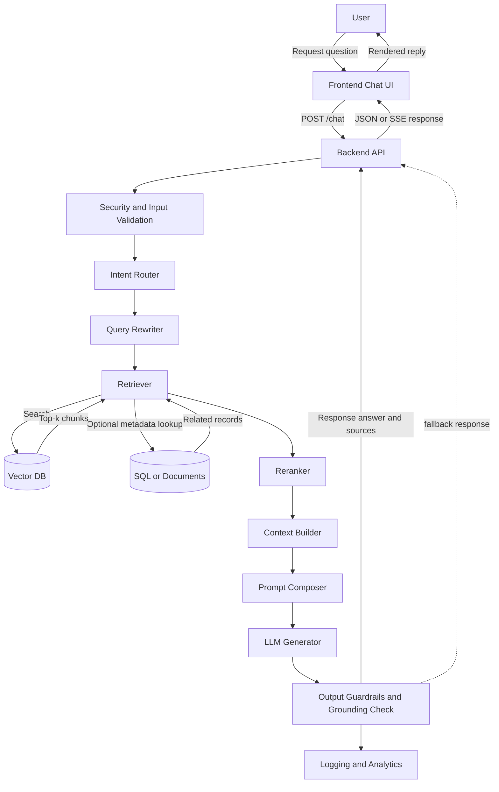

# Chatbot RAG Workflow Diagram

```mermaid
flowchart TD
    U[User] -->|Request question| FE[Frontend Chat UI]
    FE -->|POST /chat| API[Backend API]
    API --> SEC[Security and Input Validation]
    SEC --> INTENT[Intent Router]
    INTENT --> REWRITE[Query Rewriter]
    REWRITE --> RET[Retriever]

    RET -->|Search| VDB[(Vector DB)]
    RET -->|Optional metadata lookup| SQL[(SQL or Documents)]
    VDB -->|Top-k chunks| RET
    SQL -->|Related records| RET

    RET --> RERANK[Reranker]
    RERANK --> CTX[Context Builder]
    CTX --> PROMPT[Prompt Composer]
    PROMPT --> LLM[LLM Generator]
    LLM --> GUARD[Output Guardrails and Grounding Check]

    GUARD -->|Response answer and sources| API
    API -->|JSON or SSE response| FE
    FE -->|Rendered reply| U

    GUARD --> LOG[Logging and Analytics]
    GUARD -. fallback response .-> API
```