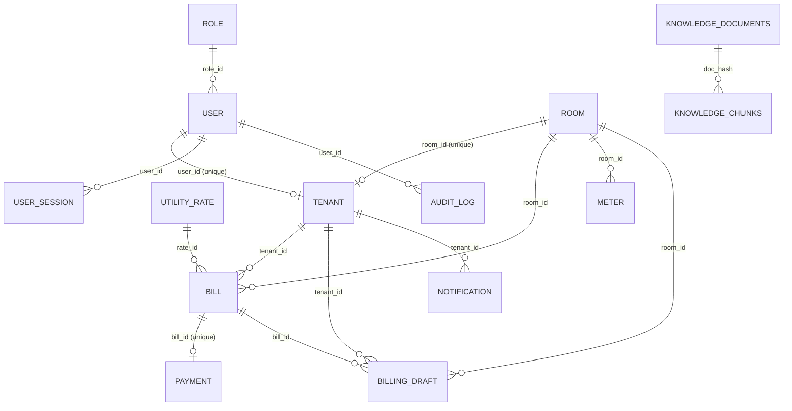

# Database Structure (RoomKub) - Full Version

เอกสารนี้สรุปจาก `backend/prisma/schema.prisma` แบบครบทุกคอลัมน์ เพื่อใช้วาด ER Diagram ได้ทันที

## วิธีอ่านเอกสาร
- PK = Primary Key
- FK = Foreign Key
- UQ = Unique Constraint
- IDX = Index
- Null = อนุญาต `NULL`
- Default = ค่าเริ่มต้นจากฐานข้อมูล
- หมายเหตุ: ฟิลด์ relation ของ Prisma (เช่น `user user @relation(...)`) ไม่ใช่คอลัมน์จริงในตาราง จึงแยกไว้ในหัวข้อ Relationship

---

## 1) Entity รายตาราง (ครบทุกคอลัมน์)

## 1.1 `role`
| คอลัมน์ | ชนิดข้อมูล | Null | Key | Default | รายละเอียด |
|---|---|---|---|---|---|
| role_id | Int | No | PK | autoincrement() | รหัสบทบาท |
| role_name | String | No | - | - | ชื่อบทบาท |

Relationship
- `role.role_id` (1) -> (N) `user.role_id`

---

## 1.2 `user`
| คอลัมน์ | ชนิดข้อมูล | Null | Key | Default | รายละเอียด |
|---|---|---|---|---|---|
| user_id | Int | No | PK | autoincrement() | รหัสผู้ใช้ |
| username | String | No | UQ | - | ชื่อผู้ใช้ |
| password_hash | String | No | - | - | รหัสผ่านแบบ hash |
| role_id | Int | No | FK, IDX | - | อ้างอิงบทบาท |

FK
- `role_id` -> `role.role_id` (`USER_role_id_fkey`)

Index
- `USER_role_id_fkey` (`role_id`)

Relationship
- `user` (N) -> (1) `role`
- `user` (1) -> (0..1) `tenant`
- `user` (1) -> (N) `user_session`
- `user` (1) -> (N) `audit_log`

---

## 1.3 `user_session`
| คอลัมน์ | ชนิดข้อมูล | Null | Key | Default | รายละเอียด |
|---|---|---|---|---|---|
| id | Int | No | PK | autoincrement() | รหัส session |
| user_id | Int | No | FK, IDX | - | ผู้ใช้เจ้าของ session |
| refresh_token_hash | String | No | - | - | hash ของ refresh token |
| expires_at | DateTime | No | IDX | - | เวลาหมดอายุ |
| revoked | Boolean | No | IDX | false | สถานะเพิกถอน |
| created_at | DateTime | No | - | now() | วันที่สร้าง |

FK
- `user_id` -> `user.user_id` (`USER_SESSION_user_id_fkey`)

Index
- `USER_SESSION_expires_at_idx` (`expires_at`)
- `USER_SESSION_user_id_revoked_idx` (`user_id`, `revoked`)

Relationship
- `user_session` (N) -> (1) `user`

---

## 1.4 `audit_log`
| คอลัมน์ | ชนิดข้อมูล | Null | Key | Default | รายละเอียด |
|---|---|---|---|---|---|
| audit_log_id | Int | No | PK | autoincrement() | รหัส log |
| user_id | Int | No | FK, IDX | - | ผู้ใช้ที่ทำ action |
| action | String | No | - | - | การกระทำ |
| entity | String | No | - | - | ชื่อตาราง/โดเมนที่ถูกกระทำ |
| entity_id | Int | No | - | - | id ของข้อมูลที่ถูกกระทำ |
| metadata | Json | No | - | - | ข้อมูลเสริม |
| created_at | DateTime | No | IDX | now() | เวลาบันทึก log |

FK
- `user_id` -> `user.user_id` (`AUDIT_LOG_user_id_fkey`)

Index
- `AUDIT_LOG_created_at_idx` (`created_at`)
- `AUDIT_LOG_user_id_idx` (`user_id`)

Relationship
- `audit_log` (N) -> (1) `user`

---

## 1.5 `room`
| คอลัมน์ | ชนิดข้อมูล | Null | Key | Default | รายละเอียด |
|---|---|---|---|---|---|
| room_id | Int | No | PK | autoincrement() | รหัสห้อง |
| room_number | String | No | UQ | - | เลขห้อง |
| floor | Int | No | - | - | ชั้น |
| price | Decimal | No | - | - | ค่าเช่าพื้นฐาน |
| status | room_status | No | - | - | สถานะห้อง |
| room_type | room_type | No | - | Standard | ประเภทห้อง |

Unique
- `ROOM_room_number_key` (`room_number`)

Relationship
- `room` (1) -> (0..1) `tenant`
- `room` (1) -> (N) `bill`
- `room` (1) -> (N) `billing_draft`
- `room` (1) -> (N) `meter`

---

## 1.6 `tenant`
| คอลัมน์ | ชนิดข้อมูล | Null | Key | Default | รายละเอียด |
|---|---|---|---|---|---|
| tenant_id | Int | No | PK | autoincrement() | รหัสผู้เช่า |
| tenant_code | String | Yes | UQ | - | รหัสผู้เช่า |
| user_id | Int | No | FK, UQ | - | อ้างอิงผู้ใช้ |
| full_name | String | No | - | - | ชื่อ-นามสกุล |
| citizen_id | String | No | UQ | - | เลขบัตรประชาชน |
| phone | String | No | UQ | - | เบอร์โทรศัพท์ |
| start_date | DateTime | No | - | - | วันเริ่มสัญญา |
| room_id | Int | No | FK, UQ | - | อ้างอิงห้อง |
| line_id | String | Yes | - | - | LINE ID |

FK
- `user_id` -> `user.user_id` (`TENANT_user_id_fkey`)
- `room_id` -> `room.room_id` (`TENANT_room_id_fkey`)

Unique
- `TENANT_tenant_code_key` (`tenant_code`)
- `TENANT_user_id_key` (`user_id`)
- `TENANT_citizen_id_key` (`citizen_id`)
- `TENANT_phone_key` (`phone`)
- `TENANT_room_id_key` (`room_id`)

Relationship
- `tenant` (1) -> (1) `user`
- `tenant` (1) -> (1) `room`
- `tenant` (1) -> (N) `bill`
- `tenant` (1) -> (N) `billing_draft`
- `tenant` (1) -> (N) `notification`

---

## 1.7 `utility_rate`
| คอลัมน์ | ชนิดข้อมูล | Null | Key | Default | รายละเอียด |
|---|---|---|---|---|---|
| rate_id | Int | No | PK | autoincrement() | รหัสเรทค่าน้ำไฟ |
| water_rate | Decimal | No | - | - | อัตราค่าน้ำ |
| electric_rate | Decimal | No | - | - | อัตราค่าไฟ |
| effective_date | DateTime | No | - | - | วันที่เริ่มมีผล |

Relationship
- `utility_rate` (1) -> (N) `bill`

---

## 1.8 `meter`
| คอลัมน์ | ชนิดข้อมูล | Null | Key | Default | รายละเอียด |
|---|---|---|---|---|---|
| meter_id | Int | No | PK | autoincrement() | รหัสมิเตอร์ |
| room_id | Int | No | FK, IDX | - | ห้องที่จดมิเตอร์ |
| month | String | No | UQ(comp), IDX | - | เดือนบันทึก |
| water_meter | Decimal | No | - | - | ค่าน้ำที่จด |
| electric_meter | Decimal | No | - | - | ค่าไฟที่จด |

FK
- `room_id` -> `room.room_id` (`METER_room_id_fkey`)

Unique
- `METER_room_id_month_key` (`room_id`, `month`)

Index
- `METER_room_id_fkey` (`room_id`)
- `METER_month_idx` (`month`)
- `METER_month_room_id_idx` (`month`, `room_id`)

Relationship
- `meter` (N) -> (1) `room`

---

## 1.9 `billing_cycle`
| คอลัมน์ | ชนิดข้อมูล | Null | Key | Default | รายละเอียด |
|---|---|---|---|---|---|
| cycle_id | Int | No | PK | autoincrement() | รหัสรอบบิล |
| month | String | No | UQ | - | เดือนรอบบิล |
| due_date | DateTime | Yes | - | - | วันครบกำหนด |
| status | billing_cycle_status | No | - | Draft | สถานะรอบบิล |
| generated_count | Int | No | - | 0 | จำนวนบิลที่สร้าง |
| generated_at | DateTime | Yes | - | - | เวลาสร้างบิล |
| created_at | DateTime | No | - | now() | วันที่สร้าง |
| updated_at | DateTime | No | - | updatedAt | วันที่แก้ไขล่าสุด |

Unique
- `BILLING_CYCLE_month_key` (`month`)

---

## 1.10 `billing_draft`
| คอลัมน์ | ชนิดข้อมูล | Null | Key | Default | รายละเอียด |
|---|---|---|---|---|---|
| draft_id | Int | No | PK | autoincrement() | รหัส draft |
| room_id | Int | No | FK | - | ห้องเป้าหมาย |
| tenant_id | Int | Yes | FK, IDX | - | ผู้เช่า (ถ้ามี) |
| month | String | No | UQ(comp), IDX | - | เดือนของ draft |
| due_date | DateTime | Yes | - | - | วันครบกำหนด |
| service_price | Decimal | No | - | 0 | ค่าบริการเพิ่ม |
| fine_price | Decimal | No | - | 0 | ค่าปรับ |
| include | Boolean | No | - | true | รวมในรอบสร้างบิลหรือไม่ |
| confirmed | Boolean | No | - | false | ยืนยันแล้วหรือไม่ |
| generated_at | DateTime | Yes | IDX | - | เวลาที่ถูก generate |
| bill_id | Int | Yes | FK, IDX | - | bill ที่เชื่อมแล้ว |
| created_at | DateTime | No | - | now() | วันที่สร้าง |
| updated_at | DateTime | No | - | updatedAt | วันที่แก้ไขล่าสุด |

FK
- `room_id` -> `room.room_id` (`BILLING_DRAFT_room_id_fkey`)
- `tenant_id` -> `tenant.tenant_id` (`BILLING_DRAFT_tenant_id_fkey`)
- `bill_id` -> `bill.bill_id` (`BILLING_DRAFT_bill_id_fkey`)

Unique
- `BILLING_DRAFT_room_id_month_key` (`room_id`, `month`)

Index
- `BILLING_DRAFT_month_generated_at_idx` (`month`, `generated_at`)
- `BILLING_DRAFT_tenant_id_idx` (`tenant_id`)
- `BILLING_DRAFT_bill_id_idx` (`bill_id`)

Relationship
- `billing_draft` (N) -> (1) `room`
- `billing_draft` (N) -> (0..1) `tenant`
- `billing_draft` (N) -> (0..1) `bill`

---

## 1.11 `bill`
| คอลัมน์ | ชนิดข้อมูล | Null | Key | Default | รายละเอียด |
|---|---|---|---|---|---|
| bill_id | Int | No | PK | autoincrement() | รหัสบิล |
| room_id | Int | No | FK, IDX, UQ(comp) | - | ห้อง |
| tenant_id | Int | No | FK, IDX | - | ผู้เช่า |
| month | String | No | UQ(comp) | - | เดือนของบิล |
| total_amount | Decimal | No | - | - | ยอดรวม |
| due_date | DateTime | No | IDX(comp) | - | วันครบกำหนด |
| status | bill_status | No | IDX(comp) | - | สถานะบิล |
| rate_id | Int | No | FK, IDX | - | เรทค่าน้ำไฟ |

FK
- `room_id` -> `room.room_id` (`BILL_room_id_fkey`)
- `tenant_id` -> `tenant.tenant_id` (`BILL_tenant_id_fkey`)
- `rate_id` -> `utility_rate.rate_id` (`BILL_rate_id_fkey`)

Unique
- `BILL_room_id_month_key` (`room_id`, `month`)

Index
- `BILL_rate_id_fkey` (`rate_id`)
- `BILL_room_id_fkey` (`room_id`)
- `BILL_tenant_id_fkey` (`tenant_id`)
- `BILL_status_due_date_idx` (`status`, `due_date`)
- `BILL_tenant_status_due_date_idx` (`tenant_id`, `status`, `due_date`)

Relationship
- `bill` (N) -> (1) `room`
- `bill` (N) -> (1) `tenant`
- `bill` (N) -> (1) `utility_rate`
- `bill` (1) -> (0..1) `payment`
- `bill` (1) -> (N) `billing_draft`

---

## 1.12 `payment`
| คอลัมน์ | ชนิดข้อมูล | Null | Key | Default | รายละเอียด |
|---|---|---|---|---|---|
| payment_id | Int | No | PK | autoincrement() | รหัสการจ่าย |
| bill_id | Int | No | FK, UQ | - | อ้างอิงบิล |
| payment_date | DateTime | No | IDX(comp) | - | วันที่ชำระ |
| amount | Decimal | No | - | - | จำนวนเงินที่จ่าย |
| status | payment_status | No | IDX(comp) | - | สถานะการชำระ |
| expires_at | DateTime | No | IDX | - | เวลาหมดอายุการชำระ |
| expired_at | DateTime | Yes | - | - | เวลาที่หมดอายุจริง |
| created_at | DateTime | No | - | now() | วันที่สร้าง |
| updated_at | DateTime | No | - | updatedAt | วันที่แก้ไขล่าสุด |
| slip_reference | String | Yes | UQ, IDX | - | reference จากผู้ให้บริการตรวจสลิป |
| slip_hash | String | Yes | UQ, IDX | - | hash กันสลิปซ้ำ |
| slip_url | String | Yes | - | - | URL รูปสลิป |
| verified_at | DateTime | Yes | - | - | เวลาตรวจสอบผ่าน |
| verification_source | String | Yes | - | - | แหล่งที่ตรวจสอบ |
| raw_slip_data | Json | Yes | - | - | payload ดิบจากระบบตรวจสลิป |

FK
- `bill_id` -> `bill.bill_id` (`PAYMENT_bill_id_fkey`)

Unique
- `PAYMENT_bill_id_key` (`bill_id`)
- `PAYMENT_slip_reference_key` (`slip_reference`)
- `PAYMENT_slip_hash_key` (`slip_hash`)

Index
- `idx_payment_slip_reference` (`slip_reference`)
- `idx_payment_slip_hash` (`slip_hash`)
- `idx_payment_expires_at` (`expires_at`)
- `PAYMENT_status_payment_date_idx` (`status`, `payment_date`)

Relationship
- `payment` (1) -> (1) `bill` (เชิงบังคับด้วย unique bill_id)

---

## 1.13 `notification`
| คอลัมน์ | ชนิดข้อมูล | Null | Key | Default | รายละเอียด |
|---|---|---|---|---|---|
| notification_id | Int | No | PK | autoincrement() | รหัสแจ้งเตือน |
| tenant_id | Int | No | FK, IDX | - | ผู้เช่าปลายทาง |
| message | String | No | - | - | ข้อความ |
| sent_date | DateTime | No | - | - | วันที่ส่ง |
| is_read | Boolean | No | - | false | อ่านแล้วหรือไม่ |
| read_at | DateTime | Yes | - | - | เวลาอ่าน |

FK
- `tenant_id` -> `tenant.tenant_id` (`NOTIFICATION_tenant_id_fkey`)

Index
- `NOTIFICATION_tenant_id_fkey` (`tenant_id`)

Relationship
- `notification` (N) -> (1) `tenant`

---

## 1.14 `line_group`
| คอลัมน์ | ชนิดข้อมูล | Null | Key | Default | รายละเอียด |
|---|---|---|---|---|---|
| id | Int | No | PK | autoincrement() | รหัสกลุ่ม |
| group_name | String | No | - | - | ชื่อกลุ่ม LINE |
| group_id | String | No | UQ | - | group id ของ LINE |
| description | String | Yes | - | - | คำอธิบาย |
| created_at | DateTime | No | - | now() | วันที่สร้าง |

Unique
- `LINE_GROUP_group_id_key` (`group_id`)

---

## 1.15 `notification_history`
| คอลัมน์ | ชนิดข้อมูล | Null | Key | Default | รายละเอียด |
|---|---|---|---|---|---|
| id | Int | No | PK | autoincrement() | รหัสประวัติ |
| message | String(@db.Text) | No | - | - | ข้อความที่ส่ง |
| group_id | String | No | - | - | group id ปลายทาง |
| group_name | String | No | - | - | ชื่อกลุ่มปลายทาง |
| status | String | No | IDX(comp) | - | สถานะการส่ง |
| error_message | String?(@db.Text) | Yes | - | - | error message |
| sent_at | DateTime | No | IDX, IDX(comp) | now() | เวลาส่ง |

Index
- `NOTIFICATION_HISTORY_sent_at_idx` (`sent_at`)
- `NOTIFICATION_HISTORY_status_sent_at_idx` (`status`, `sent_at`)

---

## 1.16 `knowledge_base`
| คอลัมน์ | ชนิดข้อมูล | Null | Key | Default | รายละเอียด |
|---|---|---|---|---|---|
| id | Int | No | PK | autoincrement() | รหัสความรู้ |
| category | String | No | IDX | - | หมวดหมู่ |
| topic | String | No | IDX | - | หัวข้อ |
| question | String(@db.Text) | No | FULLTEXT | - | คำถาม |
| answer | String(@db.Text) | No | FULLTEXT | - | คำตอบ |
| metadata_json | Json | Yes | - | - | metadata เพิ่มเติม |
| created_at | DateTime | No | - | now() | วันที่สร้าง |

Index
- `KNOWLEDGE_BASE_category_idx` (`category`)
- `KNOWLEDGE_BASE_topic_idx` (`topic`)
- `KNOWLEDGE_BASE_question_answer_ft_idx` FULLTEXT (`question`, `answer`)

---

## 1.17 `knowledge_documents`
| คอลัมน์ | ชนิดข้อมูล | Null | Key | Default | รายละเอียด |
|---|---|---|---|---|---|
| id | String(@db.VarChar(36)) | No | PK | - | document uuid |
| doc_hash | String(@db.VarChar(64)) | No | UQ | - | hash เอกสาร |
| owner_id | Int | No | IDX(comp) | - | เจ้าของเอกสาร (ยังไม่ผูก FK) |
| doc_name | String(@db.VarChar(255)) | No | - | - | ชื่อเอกสาร |
| status | String(@db.VarChar(32)) | No | IDX(comp) | "uploaded" | สถานะการประมวลผล |
| created_at | DateTime | No | IDX(comp) | now() | วันที่สร้าง |
| updated_at | DateTime | No | IDX(comp) | now() | วันที่แก้ไขล่าสุด |

Unique
- `KNOWLEDGE_DOCUMENTS_doc_hash_key` (`doc_hash`)

Index
- `KNOWLEDGE_DOCUMENTS_owner_status_created_idx` (`owner_id`, `status`, `created_at`)
- `KNOWLEDGE_DOCUMENTS_status_updated_idx` (`status`, `updated_at`)

Relationship
- `knowledge_documents` (1) -> (N) `knowledge_chunks` ผ่าน `doc_hash`

---

## 1.18 `knowledge_chunks`
| คอลัมน์ | ชนิดข้อมูล | Null | Key | Default | รายละเอียด |
|---|---|---|---|---|---|
| chunk_id | String(@db.VarChar(36)) | No | PK | - | chunk uuid |
| doc_hash | String(@db.VarChar(64)) | No | FK, IDX, UQ(comp) | - | อ้างอิงเอกสาร |
| chunk_no | Int | No | UQ(comp) | - | ลำดับ chunk |
| text | String(@db.LongText) | No | - | - | เนื้อหา chunk |
| embedding | Json | Yes | - | - | เวกเตอร์ embedding |
| metadata_json | Json | Yes | - | - | metadata ของ chunk |
| created_at | DateTime | No | - | now() | วันที่สร้าง |

FK
- `doc_hash` -> `knowledge_documents.doc_hash` (`KNOWLEDGE_CHUNKS_doc_hash_fkey`)

Unique
- `KNOWLEDGE_CHUNKS_doc_hash_chunk_no_key` (`doc_hash`, `chunk_no`)

Index
- `KNOWLEDGE_CHUNKS_doc_hash_idx` (`doc_hash`)

Relationship
- `knowledge_chunks` (N) -> (1) `knowledge_documents`

---

## 1.19 `chatbot_conversation_log`
| คอลัมน์ | ชนิดข้อมูล | Null | Key | Default | รายละเอียด |
|---|---|---|---|---|---|
| log_id | Int | No | PK | autoincrement() | รหัส log บทสนทนา |
| user_question | String(@db.Text) | No | - | - | คำถามผู้ใช้ |
| rewritten_query | String(@db.Text) | No | - | - | query ที่ปรับแล้ว |
| retrieved_context | Json | No | - | - | context ที่ดึงมา |
| final_answer | String(@db.Text) | No | - | - | คำตอบสุดท้าย |
| created_at | DateTime | No | IDX | now() | เวลาบันทึก |

Index
- `CHATBOT_LOG_created_at_idx` (`created_at`)

---

## 2) Relationship Matrix (สรุปสั้นสำหรับวาด ER)

| From | Cardinality | To | FK Column |
|---|---|---|---|
| role | 1:N | user | user.role_id |
| user | 1:0..1 | tenant | tenant.user_id (UQ) |
| room | 1:0..1 | tenant | tenant.room_id (UQ) |
| room | 1:N | bill | bill.room_id |
| tenant | 1:N | bill | bill.tenant_id |
| utility_rate | 1:N | bill | bill.rate_id |
| bill | 1:0..1 | payment | payment.bill_id (UQ) |
| room | 1:N | meter | meter.room_id |
| room | 1:N | billing_draft | billing_draft.room_id |
| tenant | 1:N | billing_draft | billing_draft.tenant_id |
| bill | 1:N | billing_draft | billing_draft.bill_id |
| tenant | 1:N | notification | notification.tenant_id |
| user | 1:N | user_session | user_session.user_id |
| user | 1:N | audit_log | audit_log.user_id |
| knowledge_documents | 1:N | knowledge_chunks | knowledge_chunks.doc_hash |

---

## 3) ตารางที่ไม่มี FK โดยตรง
- `billing_cycle`
- `line_group`
- `notification_history`
- `knowledge_base`
- `chatbot_conversation_log`

---

## 4) Enum ทั้งหมด

### `room_status`
- `Vacant`
- `Occupied`
- `Maintenance`

### `room_type`
- `Air`
- `Fan`
- `Standard`
- `Other`

### `payment_status`
- `Success`
- `Pending`
- `Failed`
- `Verifying`
- `Verified`
- `Rejected`
- `Expired`

### `bill_status`
- `Paid`
- `Unpaid`
- `Pending`
- `Overdue`
- `Cancelled`

### `billing_cycle_status`
- `Draft`
- `Ready`
- `Generated`

---

## 5) Mermaid ER Diagram (พร้อมใช้)

---

## 6) Best Practice (เน้นใช้งานจริง)
1. ควรกำหนดมาตรฐานฟิลด์ `month` เป็น `YYYY-MM` และ validate ที่ API ทุก endpoint
2. ฟิลด์เงินทั้งหมดใช้ `Decimal` แล้วควบคุม precision/scale ใน migration ให้ชัด
3. ตารางที่โตเร็ว (`audit_log`, `notification_history`, `chatbot_conversation_log`) ควรมี retention policy
4. หากต้องการความถูกต้องเชิงสัมพันธ์สูงขึ้น ให้พิจารณาเพิ่ม FK ใน `notification_history.group_id -> line_group.group_id`
5. แยกสถานะธุรกิจให้ไม่ทับความหมาย เช่น `Pending` กับ `Verifying`
6. ก่อนเพิ่ม index ใหม่ ให้ยืนยันกับ query pattern จริงและดูผลกระทบการเขียนข้อมูล

